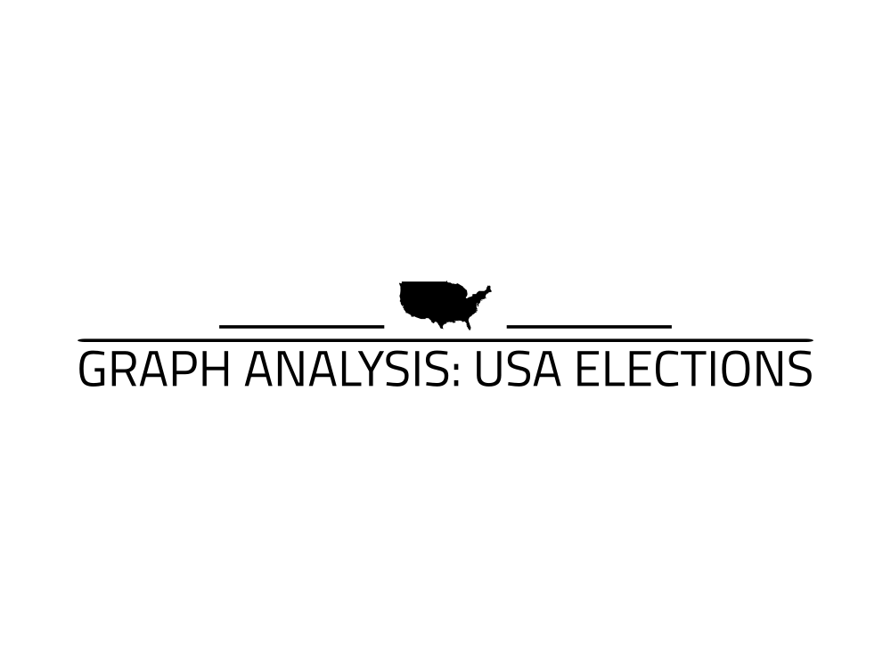
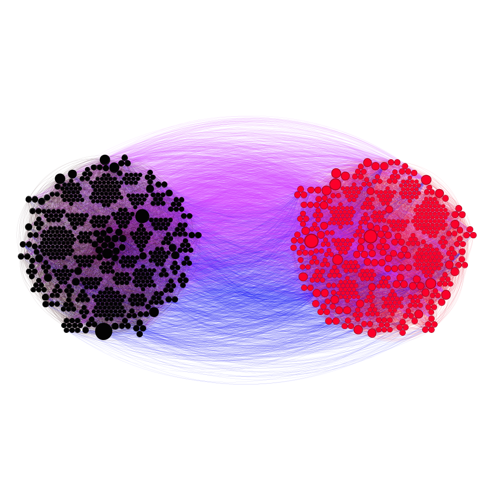

# Political-Blog-2004-U.S.-Election-Analysis
Network analysis with gephi and networkX

 
  

<h1 align="center"> Graph Analysis: USA 2004 Elections </h1>
<h3 align="center"> Degree course: Computer science and engineering </h3>
<h5 align="center"> Project Assignment - Complessità nei sistemi e nelle reti  - <a href="https://www.polimi.it/">Politecnico of Milan</a> (March 2023) </h5>

 
  

<!-- TABLE OF CONTENTS -->
<h2 id="table-of-contents"> :book: Table of Contents</h2>

  
Table of Contents

  <ol>
    <li><a href="#about-the-project"> ➤ About The Project</a></li>
    <li><a href="#overview"> ➤ Overview</a></li>
    <li><a href="#project-files-description"> ➤ Project Files Description</a></li>
    <li><a href="#getting-started"> ➤ Getting Started</a></li>
    <li><a href="#graph-analysis"> ➤ Graph analysis</a></li>
    <li><a href="#references"> ➤ References</a></li>
    <li><a href="#credits"> ➤ Credits</a></li>
  </ol>

<!-- ABOUT THE PROJECT -->
<h2 id="about-the-project"> :pencil: About The Project</h2>

 
 The focus of the project, is to analyse the directed graph of the 2004 USA political elections. A directed graph is a graphical representation of a set of objects in which some pairs of the objects are connected by links that have a specific direction. In this case, the nodes are the blogs (conservative and liberal), and the links represent the hyperlinks between them.

<!-- OVERVIEW -->
<h2 id="overview"> :cloud: Overview</h2>

 
   The project provided a valuable perspective on the 2004 USA political elections and demonstrated the power of graph theory in analyzing complex data sets. The insights gained from this project could be useful in future political campaigns and provide a foundation for further research into the dynamics of political elections.

<!-- PROJECT FILES DESCRIPTION -->
<h2 id="project-files-description"> :floppy_disk: Project Files Description</h2>

<ul>
  <li><b>main.py</b> - Where all analysis reside.</li>
</ul>

<h3>Some other supporting files</h3>
<ul>
  <li><b>conservativeVSliberal.gephi</b> - Network graph with only conservative vs liberal partitioning.</li>
  <li><b>political.gephi</b> - Network graph with all necessary data.</li>
  <li><b>FindingCommunities.m</b> - Alpha communities and alpha partitions generator.</li>
  <li><b>CorePeriphery.m</b> - Core periphery profile generator.</li>
  <li><b>importNetworkScc.m</b> - Adjaceny generator.</li>
  <li><b>edge_list.csv</b> - Edge list.</li>
  <li><b>orientation.csv</b> - Contains blogs possible orientation.</li>
  <li><b>orientation_index.csv</b> - Contains blogs id with relative orientation.</li>
  <li><b>edge_list_with_type.csv</b> - Edge list with reltive edge color based on nodes id.</li>
  <li><b>centrality_metrics.csv</b> - Contains blogs id with realtive in- and out- closeness centrality.</li>
  <li><b>Blog_link_gephi.csv</b> - Edge list without id, but with orientation.</li>
  <li><b>largest_component.csv</b> - Edge list of largest strongly connected component.</li>
  <li><b>Politican_Blogs_kcoreDecomposition.csv</b> - Edge list for k-Core decomposition.</li>
</ul>

<!-- GETTING STARTED -->
<h2 id="getting-started"> :book: Getting Started</h2>

You are able to start the game by typing the following commands in the command line:

<pre><code>$ python main.py</code></pre>

You can see the list of all options and their default values via:

<pre><code>$ python main.py -h</code></pre>

<!-- Analysis -->
<h2 id="graph-analysis"> :small_orange_diamond: Scenario 1: Finding a Fixed Food Dot using Depth First Search</h2>

