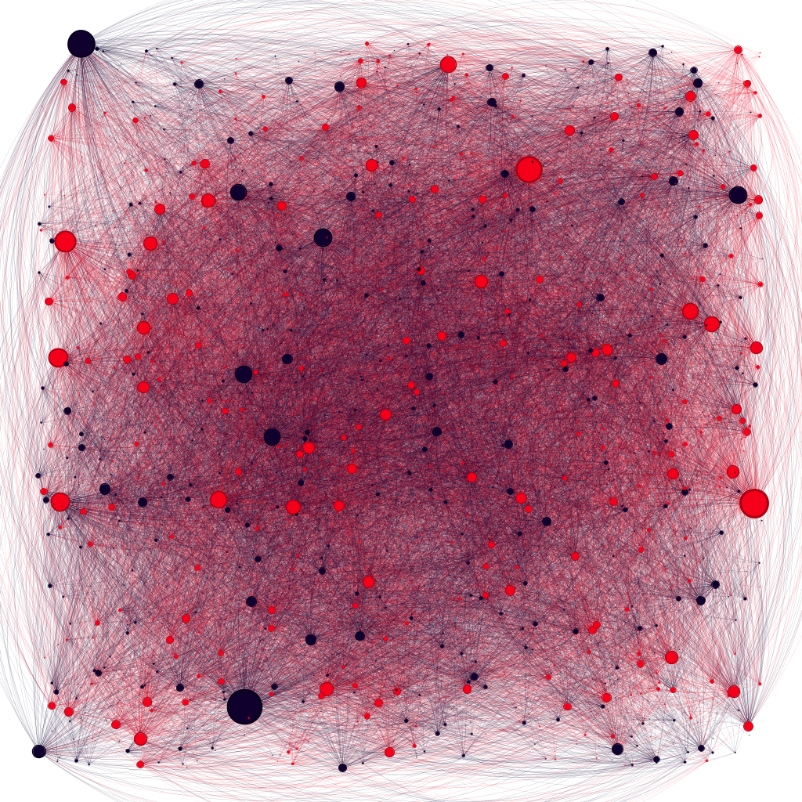
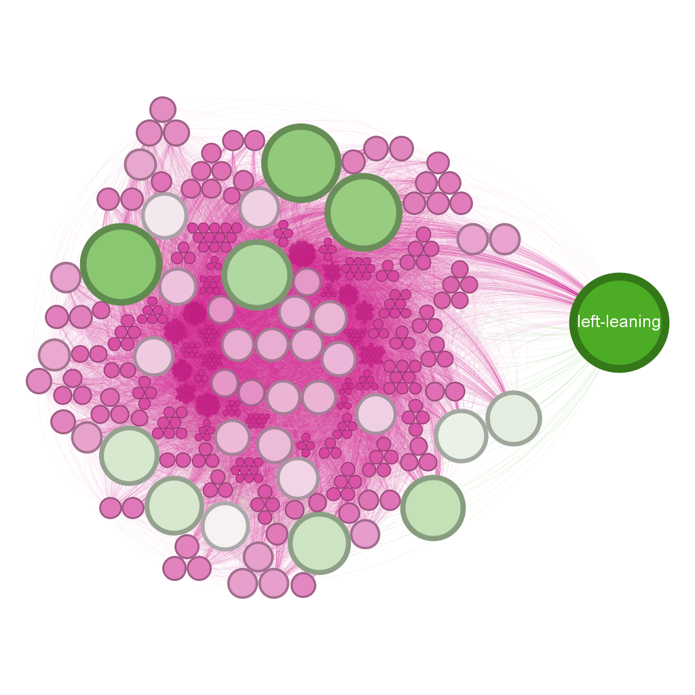
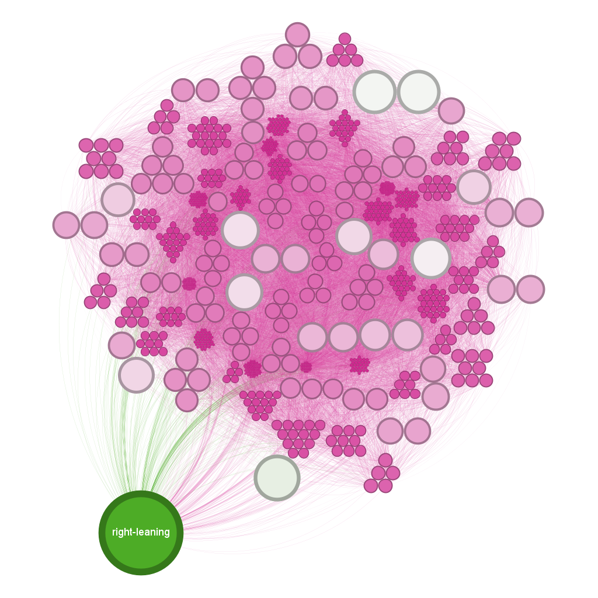
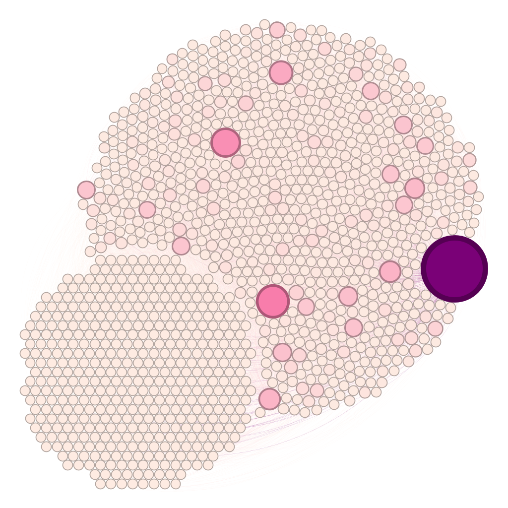
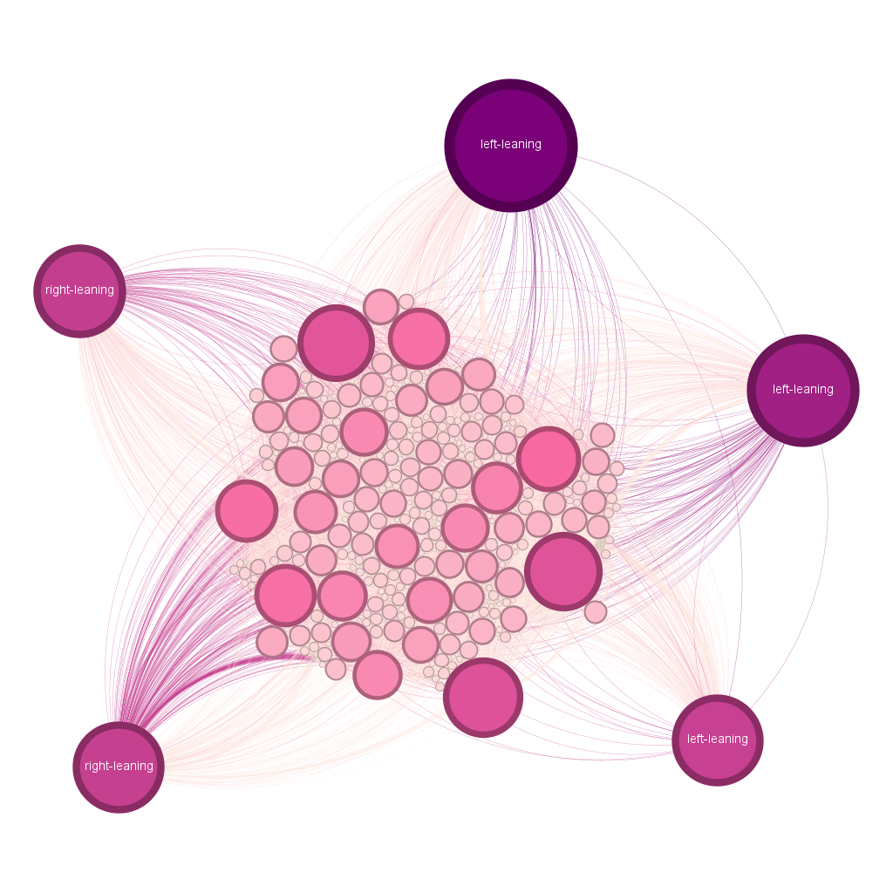
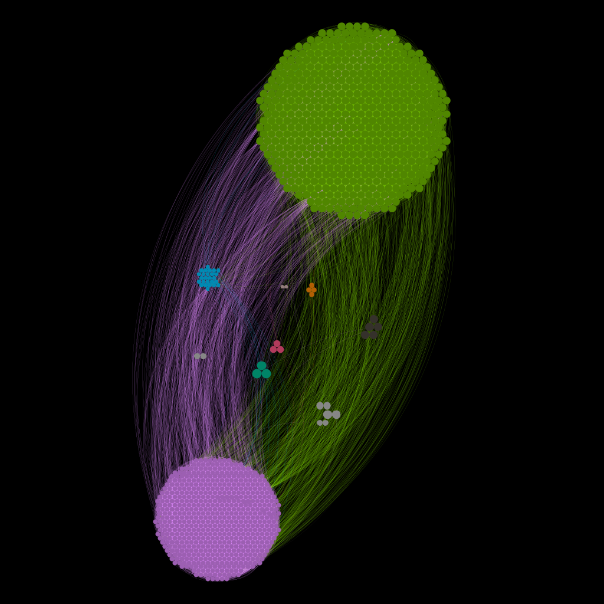
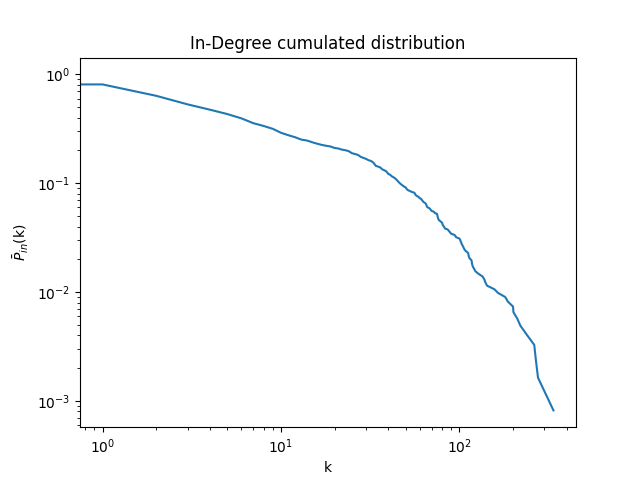
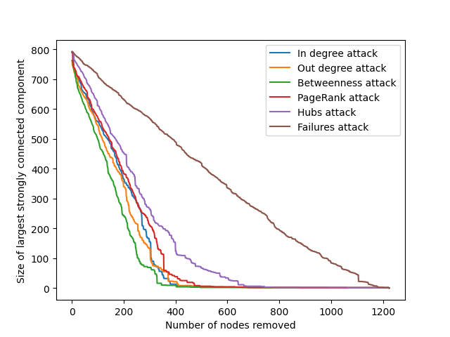

# Political-Blog-2004-U.S.-Election-Analysis
Network analysis with gephi and networkX

 
  

<h1 align="center"> Graph Analysis: USA 2004 Elections </h1>
<h3 align="center"> Degree course: Computer science and engineering </h3>
<h5 align="center"> Project Assignment - Complessità nei sistemi e nelle reti  - <a href="https://www.polimi.it/">Politecnico of Milan</a> (March 2023) </h5>

 
  

<!-- TABLE OF CONTENTS -->
<h2 id="table-of-contents"> :book: Table of Contents</h2>

  
Table of Contents

  <ol>
    <li><a href="#about-the-project"> ➤ About The Project</a></li>
    <li><a href="#overview"> ➤ Overview</a></li>
    <li><a href="#project-files-description"> ➤ Project Files Description</a></li>
    <li><a href="#graph-analysis"> ➤ Graph analysis</a></li>
    <li><a href="#references"> ➤ References</a></li>
  </ol>

<!-- ABOUT THE PROJECT -->
<h2 id="about-the-project"> :pencil: About The Project</h2>

 
 The focus of the project, is to analyse the directed graph of the 2004 USA political elections. A directed graph is a graphical representation of a set of objects in which some pairs of the objects are connected by links that have a specific direction. In this case, the nodes are the blogs (conservative and liberal), and the links represent the hyperlinks between them.

<!-- OVERVIEW -->
<h2 id="overview"> :cloud: Overview</h2>

 
   The project provided a valuable perspective on the 2004 USA political elections and demonstrated the power of graph theory in analyzing complex data sets. The insights gained from this project could be useful in future political campaigns and provide a foundation for further research into the dynamics of political elections.

<!-- PROJECT FILES DESCRIPTION -->
<h2 id="project-files-description"> :floppy_disk: Project Files Description</h2>

<ul>
  <li><b>main.py</b> - Where all analysis reside.</li>
</ul>

<h3>Some other supporting files</h3>
<ul>
  <li><b>conservativeVSliberal.gephi</b> - Network graph with only conservative vs liberal partitioning.</li>
  <li><b>political.gephi</b> - Network graph with all necessary data.</li>
  <li><b>FindingCommunities.m</b> - Alpha communities and alpha partitions generator.</li>
  <li><b>CorePeriphery.m</b> - Core periphery profile generator.</li>
  <li><b>importNetworkScc.m</b> - Adjaceny generator.</li>
  <li><b>edge_list.csv</b> - Edge list.</li>
  <li><b>orientation.csv</b> - Contains blogs possible orientation.</li>
  <li><b>orientation_index.csv</b> - Contains blogs id with relative orientation.</li>
  <li><b>edge_list_with_type.csv</b> - Edge list with reltive edge color based on nodes id.</li>
  <li><b>centrality_metrics.csv</b> - Contains blogs id with realtive in- and out- closeness centrality.</li>
  <li><b>Blog_link_gephi.csv</b> - Edge list without id, but with orientation.</li>
  <li><b>largest_component.csv</b> - Edge list of largest strongly connected component.</li>
  <li><b>Politican_Blogs_kcoreDecomposition.csv</b> - Edge list for k-Core decomposition.</li>
</ul>

<!-- Analysis -->
<h2 id="graph-analysis"> :small_orange_diamond: Graph analysis</h2>
The analysis start with an exploration of the overall structure of the graph, the network is directed and unweighted and has 1224 nodes, 19025 edges.

 
  

Looking at the network I discovered the following features:
<ul>
  <li> Conservative blogs show greater tendency to link. </li>
  <li> 82% of conservative blogs linked to at least once. </li>
  <li> 67% of liberal blogs are linked to at least once. </li>
  <li> Avg. links per blog is similar: 13.6 for liberal; 15.1 for conservative. </li>
  <li> 52% conservative blogs, 48% liberal blogs. </li>
</ul>
After that I calculated different measures because this could provide insights into the overall level of interconnectedness between conservative and liberal blogs, and whether there are any blogs that are particularly central or influential.

Below are reported the most interesting ones:
<ul>
  <li><b>In- Degree:</b> The node with higher score is the 5, which is a liberal blog. </li>
  
 
    
  

  <li><b>Out- Degree:</b> The node with higher score is the 302, which is a conservative blog. </li>
  
 
    
  

  <li><b>Betweenness Centrality:</b> The node with higher score is the 302, which is a conservative blog. </li>
  
 
    
  

  <li><b>PageRank Centrality:</b> The node with higher score is the 5, which is a liberal blog. </li>
  
 
    
  
 
</ul>
Unfortunately, in the dataset there were only the Node Id but from these results it is easy to understand how these blogs were authoritative, respected sources and their key role in spreading ideas or influencing other blogs.

Next, the analysis could focus on identifying any clusters or communities within the graph. These might represent groups of blogs that are more closely connected to each other than to blogs in other parts of the graph. The identification of such clusters could shed light on the degree of polarization between conservative and liberal blogs during the election, and whether there were any particular issues or events that were driving this polarization.

 
  

From the image it is immediately clear that there are two main communities (green and purple), which I have assumed to be the liberal and conservative blogging communities; to do this I implemented Louvain's algorithm and visualized the resulting graph with gephi.

In conclusion, with the help of the cumulative degree distribution and robustness plots:
<table><tr>
<td></td>
<td></td>
</tr></table>
I considereted the network as a scale free net.

<!-- Analysis -->
<h2 id="references"> :small_orange_diamond: References</h2>

[1]	Jérôme Kunegis. KONECT – The Koblenz Network Collection. In Proc. Int. Conf. on World Wide Web Companion, pages 1343–1350, 2013.
[2]	Lada A. Adamic and Natalie Glance. The political blogosphere and the 2004 US election: Divided they blog. In Proc. Int. Workshop on Link Discov., pages 36–43, 2005.
